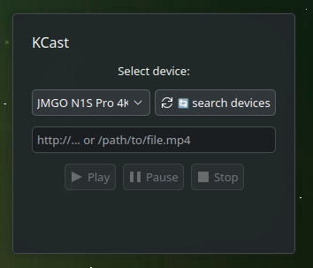
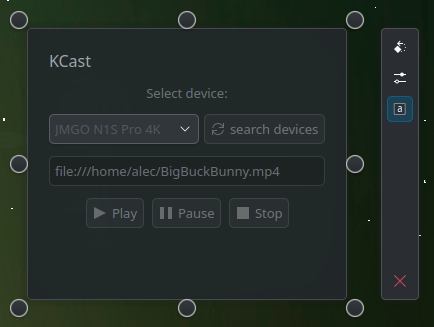

# KCast

## Name
KCast

## Description
**KCast** is a KDE Plasma 6 widget that lets you cast `.mp4` video files to Chromecast devices in your local network.
It supports device discovery, local media playback via an embedded HTTP server, and drag-and-drop integration with browsers and file managers like Dolphin.

## 📦 Features

- 📡 **Chromecast discovery** using Avahi (mDNS)
- ▶️ **Media playback controls**: Play, Pause, Resume, Stop
- 📂 **Support for local media files** via built-in HTTP server
- 🧲 **Drag & Drop** from Firefox, Chrome, or Dolphin

## Visuals

## Installation
mkdir build && cd build

cmake ..

make

make install (as root)

## 🧠 Dependencies

To run KCast successfully, the following software must be installed:

### Required

KCast is based on:

- [pychromecast](https://github.com/home-assistant-libs/pychromecast)

- [Python 3](https://www.python.org/)

- Avahi Daemon – for local network device discovery (mDNS) (systemctl status avahi-daemon)

Networking & Firewall:

- Your PC and the Chromecast must be on the same LAN

- mDNS must be allowed through the firewall

- The internal HTTP server uses TCP port 8000 to serve local files

To allow via firewalld:
_______________________

- sudo firewall-cmd --permanent --add-service=mdns
- sudo firewall-cmd --permanent --add-port=8009/tcp
- sudo firewall-cmd --reload

## Usage

- Switch on a chromecast enabled device in your locale network.
- drop a MP4 file from Dolphin and/or Web-Browser on it an hit "play"

## Support
Open an issue in git ...

[KCast Issues](https://www.opencode.net/agundur/kcast/-/issues)

## Roadmap

- Add config options like default devie
- Try add youtube support

## Contributing
accepting contributions ...

[KCast](https://www.opencode.net/agundur/kcast)

## Authors and acknowledgment
Alec

## License
GPL

## Project status
active
