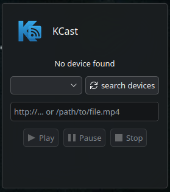
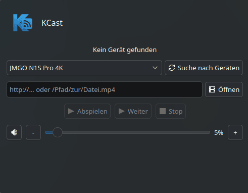

<div align="center">


  <h1>KCast</h1>
  <a href="https://kde.org/de/">
  
</a>
 <a href="https://www.gnu.org/licenses/gpl-3.0.html">
  
</a>
  <a href="https://paypal.me/agundur">
  
</a>
  <a href="https://store.kde.org/p/2290729">
  
</a>

</div>


## Description
**KCast** is a KDE Plasma 6 widget that lets you cast video files or YouTube URLs to a Chromecast device in your local network.
It supports device discovery, local media playback (served via `catt`'s own temporary HTTP server), and drag-and-drop integration with browsers and file managers like Dolphin.

**Caution!** starting with version 0.0.2 we need [catt](https://github.com/skorokithakis/catt) installed.

## Community reception

KCast was recently featured on [r/kde](https://www.reddit.com/r/kde/comments/1mmf4rb/kcast_chromecast_integration_for_kde_plasma/) and received over **38,000 views** and **305 upvotes** (99% positive).
Thanks to everyone for the amazing feedback, ideas, and testing!

If you’d like to support ongoing development, consider sponsoring the project:  
💖 [GitHub Sponsors](https://github.com/sponsors/Agundur-KDE) 


## Homepage

 [https://www.agundur.de/](https://www.agundur.de/projects/kde_cast_video-files_to_a_chromecast-device.html)

##  Features

-  **Chromecast discovery** using Avahi (mDNS)
-  **Media playback controls**: Play, Pause, Resume, Stop
-  **Local media files**, served to the Chromecast via `catt`'s own
   temporary local HTTP server
-  **YouTube and thousands of other sites**, plus direct HLS (`.m3u8`)
   stream URLs — `catt` resolves these via `yt-dlp` under the hood.
   Live-tested and confirmed working end to end. If a
   site stops working, update yt-dlp (`pipx inject catt yt-dlp --force`
   for a pipx install, or just update your `catt` package on RPM-based
   distros — it depends on your system `yt-dlp`, which stays current
   through normal updates)
-  **Drag & Drop** from Firefox, Chrome, or Dolphin


## Visuals



## 🛠️ Installation

### Build

```bash
git clone https://github.com/Agundur-KDE/KCast.git

mkdir build && cd build

cmake ..

make

make install (as root) 
```

### Arch Linux Installation
KCast is available in the [Arch User Repository (AUR)](https://aur.archlinux.org/packages/kcast).

If you use an AUR helper like `yay` or `paru`, you can install it with:

```bash
yay -S kcast
paru -S kcast
```

If you prefer to build manually from the AUR package:

```bash
git clone https://aur.archlinux.org/kcast.git
cd kcast
makepkg -si
```

**Note:** The AUR package is community-maintained by a third party
Special thanks for creating and keeping it up to date.


###  Installing KCast via the openSUSE Build Service Repository

[](https://build.opensuse.org/package/show/home:Agundur/kcast)

For openSUSE Tumbleweed (and compatible systems):

```bash
# Add the repository
sudo zypper ar -f https://download.opensuse.org/repositories/home:/Agundur/openSUSE_Tumbleweed/home:Agundur.repo

# Automatically import GPG key (required once)
sudo zypper --gpg-auto-import-keys ref

# Refresh repository metadata
sudo zypper ref

# Install KCast
sudo zypper in kcast
```

`catt` is packaged in the same `home:Agundur` repository and pulled in
automatically as a dependency — no extra step needed.

###  Installing KCast via my COPR repository (Fedora)

```bash
# Enable repository
sudo dnf copr enable agundur/KCast

# Install package
sudo dnf install kcast
```

Fedora has no `catt` package (COPR or official), so install it separately:

```bash
sudo dnf install -y pipx
pipx ensurepath
pipx install catt
catt --version
```


### Install on Debian (Trixie)

Prerequisites

 - You’re running KDE Plasma 6 on Debian 13 (Trixie) — e.g. on plasma-desktop / plasma-workspace.

 - Architecture: packages provided are amd64 (x86-64).
 
```bash
sudo apt update
sudo apt install -y pipx
pipx ensurepath   # add ~/.local/bin to PATH (log out/in if prompted)
pipx install catt
catt --version
```
Download the .deb from the [latest release](https://github.com/Agundur-KDE/KCast/releases/latest), then:

```bash
sudo apt install ./kcast_*.deb
```


## Dependencies

To run KCast successfully, the following software must be installed:

### Required

KCast is based on:

- [catt](https://github.com/skorokithakis/catt) — on openSUSE this comes
  automatically as an RPM dependency from the same repo. On Fedora/Debian
  there's no distro package for it, install via `pipx install catt`.

- [Python 3](https://www.python.org/)

- Avahi Daemon – for local network device discovery (mDNS) (systemctl status avahi-daemon)


Networking & Firewall:


- Your PC and the Chromecast must be on the same LAN

- mDNS must be allowed through the firewall

- Local files aren't served by KCast itself — `catt` spins up its own
  temporary local HTTP server on a random port to serve them, see below.

To allow via firewalld:
_______________________

- sudo firewall-cmd --permanent --add-service=mdns
- sudo firewall-cmd --permanent --add-port=8009/tcp
- sudo firewall-cmd --reload

- For the casting of local files to work you need to allow the port range 45000-47000 over tcp (catt's local file server picks a port in this range).

## Usage

- Switch on a chromecast enabled device in your locale network.
- drop a video file from Dolphin and/or Web-Browser on it an hit "play"


## Tested Hardware

KCast has been tested successfully with the JMGO N1S Pro 4K Triple Laser
Projector (supports high-quality Chromecast streaming) and a Samsung
HW-Q935GD 9.1.4-channel Q-Soundbar.


## Support


- Open an issue in git ...

[KCast Issues](https://github.com/Agundur-KDE/KCast/issues)


## UPnP/DLNA (Kodi etc.)

Under consideration for a future release, tracked in
[#8](https://github.com/Agundur-KDE/KCast/issues/8) — not started yet.


## Contributing
accepting contributions ...

[KCast](https://github.com/Agundur-KDE/KCast)


## Authors and acknowledgment
Alec

## License
GPL-3.0-or-later


## Project status
active
